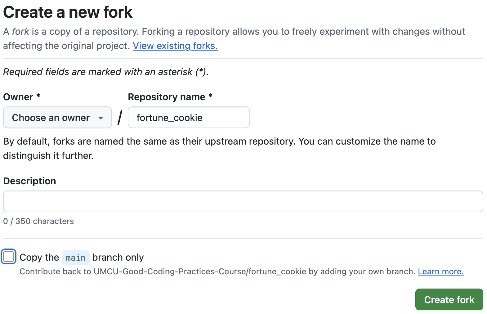
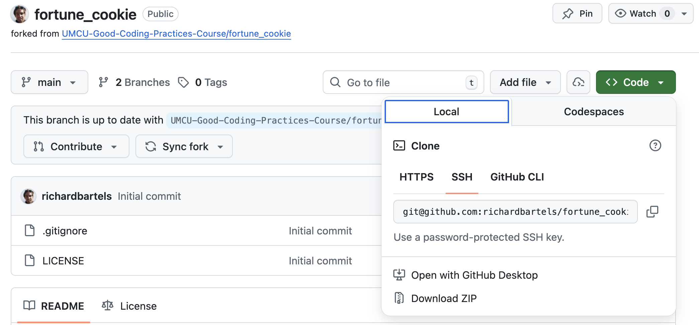
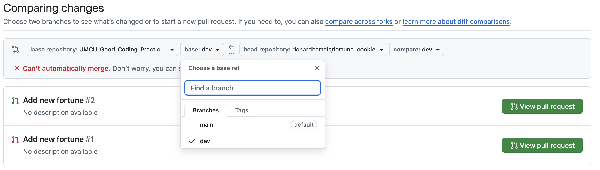

# Day 2 tutorial: `git`

## Exercise 1 - setting up `git`

### Step 1: install `git` on your system

1. Check that `git` is installed by running `git --version` in a terminal (e.g. `PowerShell`, `Command Prompt` or `git bash` on Windows). You should see something like `git version x.y.z`
2. If not yet installed, install it for your system via the official [git distribution](https://git-scm.com/install/). Note
    * On mac you can install the [command line tools](https://developer.apple.com/documentation/xcode/installing-the-command-line-tools). Easiest is to run `xcode-select --install` in the terminal.
    * On Windows you can also go to [git for windows](https://gitforwindows.org/) for the same installer.

## Exercise 2 - Contributing to a Public repository
In this exercise you'll learn to apply various `git` skills by contributing a commit to a public repository.

The repository can be found [here](https://github.com/UMCU-Good-Coding-Practices-Course/fortune_cookie).

First, you'll create a *fork* of the *fortune cookie* repository. This creates a copy of the repository in your individual account (or under an organization you are a member of). 
Next, you make a local copy (clone). You add, commit and push some code changes to your remote (the forked repository) and open a *pull request* to merge the code into the public repository. The *pull request* will have to be accepted by a maintainer of the public repo. 

This exercise is best performed using `VScode`.

### Steps 2
1. Fork the repository

*Figure: creating a fork*

2. Go to your fork and make a clone of the repository 
using `git clone` in the terminal or via the `git` extension in `VScode`

*Figure: get url for cloning*

3. Create a new branch `git checkout -b <new-branch-name>`

4. *(Optional)* Try out `fortune-cookie.py` script by running `python fortune-cookie.py` (if Python is not installed, either install it or skip this step)

5. Open `fortune-cookie.py` and add your own wisdom to the tool

6. Commit the change with a sensible commit message

7. Push your changes to the remote using `git push`
    * why does this not work right away?

8. Go to github.com and open a Pull Request. The target branch you want to merge into is not `main` but a special branch for todays practical named *YYYY<month>* (e.g. `2026june`)

*Figure: creating a pull request with target (base) branch `dev`*

9. Are there merge conflicts? Why (not)?

10. If there are merge conflicts, try to resolve them.

*Note*: this exercise might become a bit messy from step 8 onwards depending on the number of people in the course (why?)